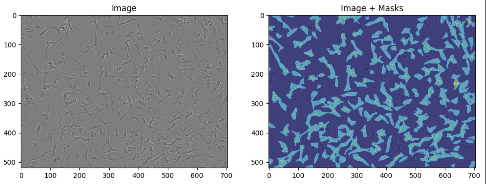
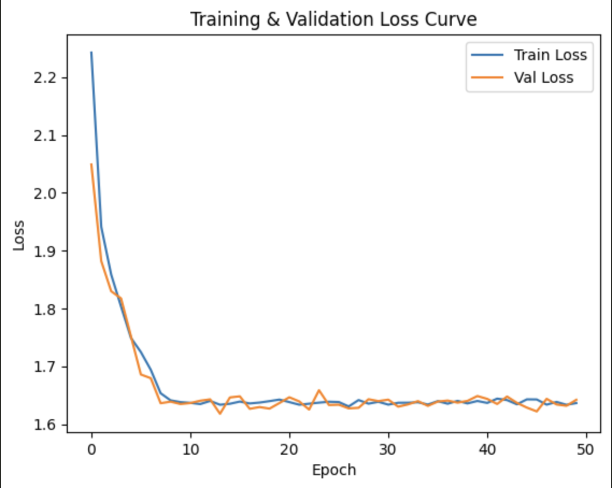
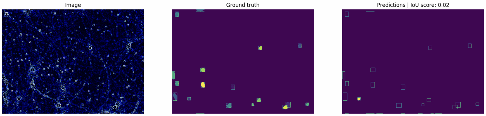
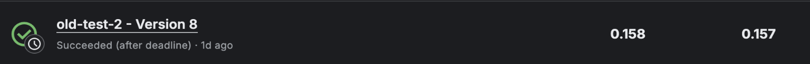

# NYCU Visual Recognition Using Deep Learning 2025 Spring Final Project
## Sartorius Cell Instance Segmentation

StudentID: 313540009
Name: Anna Kompan (安娜)

### Introduction

Task: Cell Instance Segmentation
Source: [Kaggle Competition](https://www.kaggle.com/competitions/sartorius-cell-instance-segmentation)
Content:
- train.csv —  IDs and masks for all training objects.
- sample_submission.csv - a sample submission file in the correct format
- train - train images in PNG format
- test - test images in PNG format.
- train_semi_supervised - unlabeled images offered for a semi-supervised approach.
- LIVECell_dataset_2021 - A mirror of the data from the LIVECell dataset. LIVECell is the predecessor dataset to this competition.


### Install Dependencies

```
pip install numpy pandas matplotlib opencv-python torch torchvision tqdm
```

Recommend using Conda for version cotrol
Python version used is 3.11.11

## Training & Evaluation
Preprocessing:
- Converts RLE masks to binary masks
- Groups masks by image ID

## Train Images and Masks


Augmentation:
- Customized Vertical/Horizontal Flip (for masks and images)
- Normalize
- ToTensor

Model Training:
- Download pretrained weights [maskrcnn_resnet50_fpn](https://download.pytorch.org/models/maskrcnn_resnet50_fpn_coco-bf2d0c1e.pth)
- Replace classification and mask head for dataset number of classes + 1 (background)
- Train 50 epochs
- Learning rate scheduler every 5 epochs
- Optimizer (SGD with Momentum and Weight decay)
- (Optional) Add early stopping

## Training and Validation Loss Curve


Evaluation:
- Evaluate on test dataset
- Save submission.csv with columns(id, predicted)

## Evaluation Results


## Performance Snapshot



